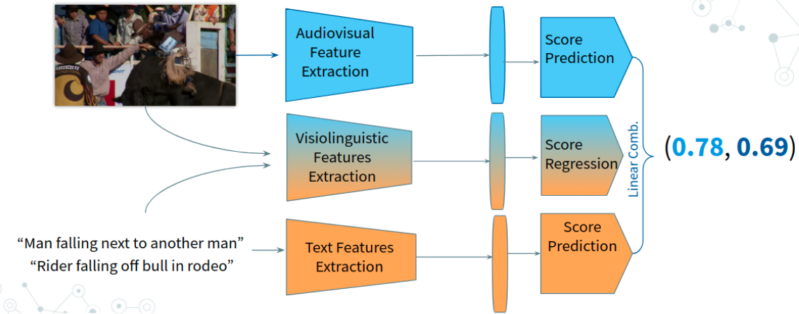
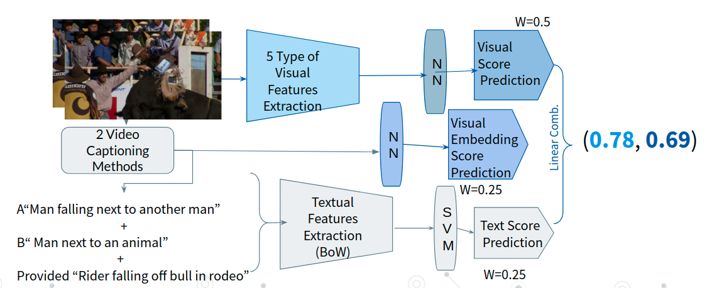

# MeMAD's participation to the MediaEval Media Memorability 2019 and 2020 challenges

 - [MediaEval Media Memorability 2019 Task](http://www.multimediaeval.org/mediaeval2019/memorability/) | [github](https://github.com/multimediaeval/2019-Predicting-Media-Memorability-Task)
 - [MediaEval Media Memorability 2020 Task](https://multimediaeval.github.io/editions/2020/tasks/memorability/) | [github](https://github.com/multimediaeval/2020-Predicting-Media-Memorability-Task)

Please cite the following if you use this code.
```
@inproceedings{reboud2019combining,
  title={Combining Textual and Visual Modeling for Predicting Media Memorability},
  author={Reboud, Alison and Harrando, Ismail and Laaksonen, Jorma and Francis, Danny and Troncy, Rapha{\"e}l and Mantec{\'o}n, H{\'e}ctor Laria},
  booktitle = {MediaEval 2019: Multimedia Benchmark Workshop},
  year={2019},
  address = {Sophia Antipolis, France}
}


```


```
@inproceedings{reboud2020predicting,
  title={Predicting Media Memorability with Audio, Video, and Text representation},
  author={Reboud, Alison and Harrando, Ismail and Laaksonen, Jorma and Troncy, Rapha{\"e}l and others},
  booktitle={MediaEval 2020: Multimedia Benchmark Workshop},
  year={2020}
}
```
## 2020 MeMAD's approach

Our approach for the 2020 edition is a weighted average method combining predictions made separately from visual, audio, textual and visiolinguisticrepresentations of videos. Two improvements from the 2019 approach are that we are now using the audio modality and focusing on video features (as opposed to image features ) allowing to better model action rich videos.




## 2019 MeMAD's approach


Our approach for the 2019 edition is a weighted average method combining predictions made separately from visual, visual embeddings  and textual and representations of videos.




## Usage

The approach consists in computing three different scores independently and later averaging them. 


#### Computing the text scores
##### mediaeval_memorability_2020.py
The script for the experiments we run for the MeMAD Memorability Challenge 2020 to evaluate the different models for the text modality.
To actually compute memorability scores, check `mediaeval_compute_scores.py`.

```
usage: textual_scores/mediaeval_memorability_2020.py [-h] [-d VIDEO_DESCRIPTIONS_PATH]
                                      [-c DEEP_CAPTION_PATH]
                                      [-s VIDEO_SCORES_PATH]
                                      [-t TEST_SET_PATH] [-r RESULTS_PATH]
                                      [-wv WORD_EMBEDDINGS_PATH]
                                      [--save_model]

Computing text scores for MediaEval 2020

optional arguments:
  -h, --help            show this help message and exit
  -d VIDEO_DESCRIPTIONS_PATH, --video_descriptions_path VIDEO_DESCRIPTIONS_PATH
                        Path to the CSV file containing video IDs and
                        corresponding description(s)
  -c DEEP_CAPTION_PATH, --deep_caption_path DEEP_CAPTION_PATH
                        Path to the file containing deep captions (in the same
                        order as the training data)
  -s VIDEO_SCORES_PATH, --video_scores_path VIDEO_SCORES_PATH
                        Path to the CSV file containing ground-truth scores.
  -t TEST_SET_PATH, --test_set_path TEST_SET_PATH
                        Path to the CSV file containing video descriptions of
                        the testset.
  -r RESULTS_PATH, --results_path RESULTS_PATH
                        Path to where to save the results for short and long
                        term predictions.
  -wv WORD_EMBEDDINGS_PATH, --word_embeddings_path WORD_EMBEDDINGS_PATH
                        Path to word embeddings (e.g. GloVe)
```


##### mediaeval_memorability_2019.py

The script for the experiments we run for the MeMAD Memorability Challenge 2019 to evaluate the different models for the text modality.

```
usage: textual_scores/mediaeval_memorability_2019.py [-h] [-d VIDEO_DESCRIPTIONS_PATH]
                                      [-wv WORD_EMBEDDINGS_PATH]
                                      [--save_model]

Computing text scores for MediaEval 2019

optional arguments:
  -h, --help            show this help message and exit
  -d VIDEO_DESCRIPTIONS_PATH, --video_descriptions_path VIDEO_DESCRIPTIONS_PATH
                        Path to the CSV file containing video IDs and
                        corresponding description(s)
  -wv WORD_EMBEDDINGS_PATH, --word_embeddings_path WORD_EMBEDDINGS_PATH
                        Path to word embeddings (e.g. GloVe)

```


#### Computing the memorability visiolinguistic scores (2020 edition only)

 Extracting Vilbert features from the frozen task-agnostic Vilbert model, following the instructions in the  `README.md`under 
[`vilbert/vilbert-multi-task`](./vilbert/vilbert-multi-task-master/)


Obtaining  and computing the memorability scores using 

``` python vilbert/mediaeval2020_pred.py ```


#### Computing the visual and audio-visual scores

Read and follow PicSOM_prediction's [`README.md`](./PicSOM_prediction/)

#### Finding the best weights combination and getting the final scores


Obtain the final score by running, combine_scores_2020.py, a code snippet for evaluating all linear combinbations of values to combine different modalities.

```
python combine_scores_2020.py
```
