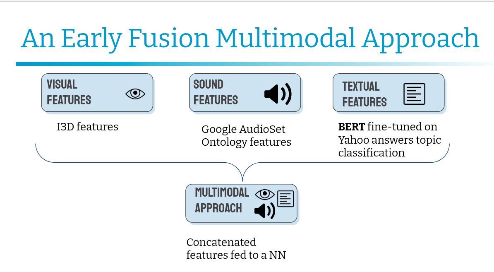

# MeMAD's participation to the MediaEval Media Memorability 2019, 2020 and 2021 challenges

 - [MediaEval Media Memorability 2019 Task](http://www.multimediaeval.org/mediaeval2019/memorability/) | [github](https://github.com/multimediaeval/2019-Predicting-Media-Memorability-Task)
 - [MediaEval Media Memorability 2020 Task](https://multimediaeval.github.io/editions/2020/tasks/memorability/) | [github](https://github.com/multimediaeval/2020-Predicting-Media-Memorability-Task)
 - [MediaEval Media Memorability 2021 Task](https://multimediaeval.github.io/editions/2021/tasks/memorability/) | [github](https://github.com/multimediaeval/2021-Predicting-Media-Memorability-Task)


Please cite the following if you use this code.
```
@inproceedings{reboud2019combining,
  title={Combining Textual and Visual Modeling for Predicting Media Memorability},
  author={Reboud, Alison and Harrando, Ismail and Laaksonen, Jorma and Francis, Danny and Troncy, Rapha{\"e}l and Mantec{\'o}n, H{\'e}ctor Laria},
  booktitle = {MediaEval 2019: Multimedia Benchmark Workshop},
  year={2019},
  address = {Sophia Antipolis, France}
}


```


```
@inproceedings{reboud2020predicting,
  title={Predicting Media Memorability with Audio, Video, and Text representation},
  author={Reboud, Alison and Harrando, Ismail and Laaksonen, Jorma and Troncy, Rapha{\"e}l and others},
  booktitle={MediaEval 2020: Multimedia Benchmark Workshop},
  year={2020}
}
```
```
@inproceedings{reboud2021exploring,
  title={Exploring Multimodality, Perplexity and Explainability forMemorability Prediction},
  author={Reboud, Alison and Harrando, Ismail and Laaksonen, Jorma and Troncy, Rapha{\"e}l and others},
  booktitle={MediaEval 2021: Multimedia Benchmark Workshop},
  year={2020}
}
```
## 2021 MeMAD's approach
For the 2021 edition we submitted different approaches.
The first one is a multimodal approach (vision,audio,text) with early fusion (the features are concatenated to produce a single prediction)


We also proposed an explainable text approach as well as an approach which relies on text perplexity measuring
[Presentation slides](https://www.slideshare.net/AlisonReboud/eurecom-and-aalto-university-at-mediaeval-2021)

## 2020 MeMAD's approach

Our approach for the 2020 edition is a weighted average method combining predictions made separately from visual, audio, textual and visiolinguisticrepresentations of videos. Two improvements from the 2019 approach are that we are now using the audio modality and focusing on video features (as opposed to image features ) allowing to better model action rich videos.


## 2019 MeMAD's approach


Our approach for the 2019 edition is a weighted average method combining predictions made separately from visual, visual embeddings  and textual and representations of videos.


## Usage

The approach consists in computing three different scores independently and later averaging them. 


#### Computing the text scores

Read and follow textual_scores prediction's [`README.md`](./textual_scores/)


#### Computing the memorability visiolinguistic scores (2020 edition only)

 Extracting Vilbert features from the frozen task-agnostic Vilbert model, following the instructions in the  `README.md`under 
[`vilbert/vilbert-multi-task`](./vilbert/vilbert-multi-task-master/)


Obtaining  and computing the memorability scores using 

``` python vilbert/mediaeval2020_pred.py ```


#### Computing the visual and audio-visual scores

Read and follow PicSOM_prediction's [`README.md`](./PicSOM_prediction/)

#### Finding the best weights combination and getting the final scores


Obtain the final score by running, combine_scores_2020.py, a code snippet for evaluating all linear combinations of values to combine different modalities.

```
python combine_scores_2020.py
```

For the 2019 edition, obtain the final scores runing
```
python combine_scores_2019.py
```


## Usage additional experiments 2021 edition

Note: All script finishing by _ns (not submitted) are experiments that werenot included in the final runs
Not submitted: 
late_fusion_2021_ns.py
SVR_ensemble_2021_ns.py is an additional experiment for late fusion ( for each modality and perplexity scores) with scores obtained with a SVM 
